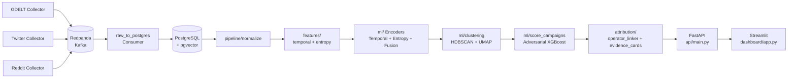

# 👻 GhostSig

> GhostSig detects coordinated inauthentic behavior (CIB) networks using behavioral metadata fingerprinting — timing cadence, cross-platform rhythm, and linguistic entropy — without content access or PII.

[](tests/)
[](requirements.txt)
[](api/main.py)
[](LICENSE)

---

## Highlights

- **No content access, no PII** — detection runs entirely on public behavioral metadata (timestamps, handle patterns, entropy signals).
- **End-to-end pipeline** — collectors → streaming → feature engineering → ML training → clustering → attribution → REST API → analyst dashboard, all in one repo.
- **Adversarially validated** — synthetic bot/organic simulators train an XGBoost discriminator; the model scores real clusters for campaign confidence.
- **Attribution-aware** — campaigns are linked to operators via shared behavioral fingerprints (timing bins, entropy bins, device echoes), producing auditable evidence cards in JSON and PDF.
- **Analyst-ready** — a Streamlit dashboard and 10-endpoint FastAPI let any analyst query campaigns, screen accounts, and download PDF evidence in minutes.

---

## Hero Metrics

| Metric | Value |
|--------|-------|
| Automated tests | **44 / 44 passing** |
| IRA-like campaign detected | **57 accounts · confidence 0.9931** |
| Adversarial model AUC | **> 0.75** asserted in test suite (`tests/test_adversarial.py`) |
| API endpoints | **10** (health, campaigns, evidence, PDF, fingerprints, screen, operators) |
| Infrastructure spin-up | **< 60 seconds** via `start.ps1` |
| Evidence output formats | **JSON + PDF** per campaign |

---

## Dashboard

> The Streamlit analyst dashboard provides 4 pages: Campaign Overview, Account Search, Operator Network, and Live Ingest.

📊 **Interactive UMAP cluster visualization:** [docs/umap_clusters.html](docs/umap_clusters.html)
📁 **Sample evidence cards (JSON + PDF):** [docs/evidence/](docs/evidence/)

---

## Architecture



---

## Quick Start

### Prerequisites

| Requirement | Version |
|-------------|---------|
| Python | 3.11+ |
| Docker Desktop | 4.x+ |
| Git | any |

### 1. Clone and install

```bash
git clone https://github.com/DevWizard-Vandan/ghostsig.git
cd ghostsig
python -m venv .venv
.\.venv\Scripts\Activate.ps1          # Windows
# source .venv/bin/activate           # macOS/Linux
pip install -r requirements.txt
```

### 2. Start infrastructure

```bash
docker compose up -d
```

Starts: **Redpanda** (Kafka-compatible broker), **PostgreSQL 16 + pgvector**, **Redis**, **MinIO**.

### 3. Run the full pipeline (one-shot)

```bash
python -m pipeline.full_pipeline --once --skip-training
```

Normalizes raw events → generates behavioral embeddings → clusters accounts → scores campaigns → writes operator attribution + evidence cards.

### 4. Start everything with one script (Windows)

```powershell
.\start.ps1
```

[`start.ps1`](start.ps1) handles Docker health checks, activates the venv, and opens two windows — the FastAPI server and the Streamlit dashboard.

### 5. Open

| Service | URL |
|---------|-----|
| Analyst Dashboard | http://localhost:8501 |
| API (Swagger UI) | http://localhost:8000/docs |
| API (ReDoc) | http://localhost:8000/redoc |

---

## Repository Structure

```
ghostsig/
├── api/                  # FastAPI application (10 endpoints, Pydantic v2 schemas)
│   └── main.py
├── attribution/          # Operator linking + evidence card generation
│   ├── operator_linker.py
│   ├── evidence_cards.py
│   └── test_datasets.py
├── collectors/           # Platform data collectors (GDELT, Twitter, Reddit)
├── consumers/            # Kafka/Redpanda → PostgreSQL consumer
├── dashboard/            # Streamlit analyst dashboard (4 pages)
│   └── app.py
├── docs/
│   ├── evidence/         # Pre-generated JSON + PDF evidence cards
│   └── umap_clusters.html
├── features/             # Feature extractors (temporal cadence, linguistic entropy)
├── infra/postgres/       # DB schema (init.sql with pgvector extension)
├── ml/                   # Encoders, clustering, adversarial training, scoring
│   ├── temporal_encoder.py
│   ├── entropy_encoder.py
│   ├── fusion_encoder.py
│   ├── clustering.py
│   ├── train_adversarial.py
│   └── score_campaigns.py
├── pipeline/             # End-to-end orchestration
│   ├── full_pipeline.py
│   └── normalize.py
├── synthetic/            # Bot + organic simulators for adversarial training data
│   └── bot_generator.py
├── tests/                # 44 pytest tests (simulators, model, pipeline, API)
├── docker-compose.yml    # Infra stack (Redpanda, Postgres, Redis, MinIO)
├── start.ps1             # One-shot Windows startup script
└── requirements.txt
```

---

## API Overview

All endpoints require the header `X-API-Key: <key>` (default dev key: `ghostsig-dev-key`).

| Method | Endpoint | Description |
|--------|----------|-------------|
| `GET` | `/health` | Service health + account/campaign counts |
| `GET` | `/campaigns` | List campaigns — filterable by confidence, platform, tier |
| `GET` | `/campaigns/{id}` | Full campaign detail with member accounts |
| `GET` | `/campaigns/{id}/evidence` | Structured JSON evidence card |
| `GET` | `/campaigns/{id}/pdf` | Downloadable PDF evidence report |
| `GET` | `/fingerprints` | Paginated account fingerprint list |
| `GET` | `/accounts/{id}/fingerprint` | Single account fingerprint + cluster membership |
| `POST` | `/screen` | Batch-screen a list of account IDs for campaign membership |
| `GET` | `/operators` | List operators (campaigns grouped by shared behavioral hash) |
| `GET` | `/operators/{id}/campaigns` | Campaigns attributed to a single operator |

Interactive docs: **http://localhost:8000/docs**

---

## Evidence Output

Every detected campaign produces two artifacts written to `docs/evidence/`:

**JSON evidence card** — machine-readable, structured:

```json
{
  "campaign_id": "e5663067-4e32-46df-b9f4-91357b5a88fc",
  "confidence": 0.993,
  "confidence_tier": "HIGH",
  "account_count": 57,
  "timing_overlap_pct": 0.767,
  "entropy_overlap_pct": 1.0,
  "device_echo_markers": 2,
  "top_accounts": [ "..." ]
}
```

**PDF evidence card** — human-readable report including campaign summary, top accounts table, behavioral signal breakdown, and operator attribution hash. Downloadable directly from the dashboard or via `GET /campaigns/{id}/pdf`.

---

## Why It Matters

**The problem:** Content-based CIB detection requires platform access, labeled training data, and breaks instantly when narratives shift.

**GhostSig's insight:** Coordinated actors cannot easily disguise *how* they post. The timing cadence regularity, shared device pools, and compressed linguistic diversity that make bot networks cost-effective also make them behaviorally distinctive. These signals persist across narrative changes, platform bans, and account rotations.

**Who uses this:**

- 🛡️ **Trust & Safety teams** — rapid, API-driven campaign triage without content review overhead
- 🔍 **OSINT researchers** — structured evidence cards and operator attribution for investigative chains
- 🗳️ **Election integrity monitors** — cross-platform coordination detection without platform API access
- 🏛️ **Policy / regulatory bodies** — auditable, source-attributed evidence suitable for public reporting

---

## Current Status

| Area | Status |
|------|--------|
| Data pipeline (collectors → normalize → features) | ✅ Complete |
| ML encoders (temporal, entropy, fusion) | ✅ Complete |
| Clustering (HDBSCAN + UMAP) | ✅ Complete |
| Adversarial training & campaign scoring | ✅ Complete |
| Attribution & evidence cards | ✅ Complete |
| FastAPI (10 endpoints, Pydantic v2) | ✅ Complete |
| Streamlit dashboard (4 pages) | ✅ Complete |
| Automated test suite | ✅ 44 / 44 passing |
| Production hardening | 🔄 In progress |

---

## Walkthrough & Demo

- **[DEMO.md](DEMO.md)** — 5-step product walkthrough for a first-time evaluator or non-developer analyst
- **[walkthrough.md](walkthrough.md)** — Technical implementation walkthrough (Day 1 production hardening)

---

## Legal & Compliance

GhostSig is **compliant by architecture**:

- No private content access
- No PII collection or storage
- No authenticated API bypass
- Compatible with DPDP Act (India), GDPR (EU), CCPA (US)

---

*GhostSig sees the coordination in the silence between posts.*
